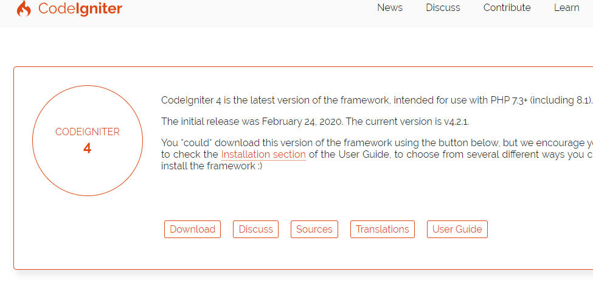
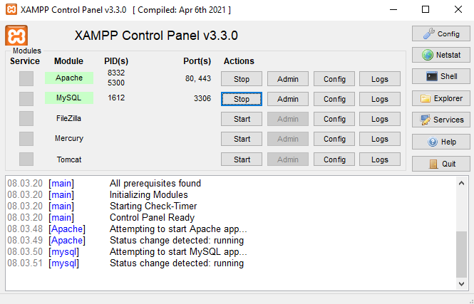
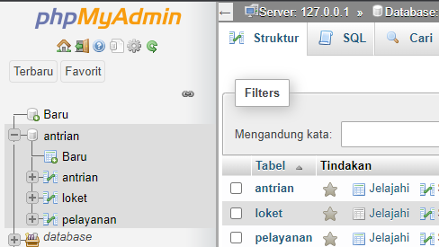
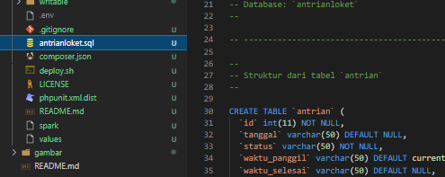

# UAS_Pemrograman

# NAMA  : Ibnu Fajar
# NIM   : 312010420
# KELAS : TI. 20 A1

# PERAKTIKUM UAS PEMROGRAMAN WEB 

**LANGKAH PERTAMA** 
kali ini kita bikin sebuah website sederhana dengan tema antrian, Kita instal terlebih dahulu CodeIgniter untuk kerangka PHP agar bisa membangun situs websitenya, seperti gambar berikut; 
 
lalu kita buka XAMPP kita nyalahkan Apache dan MySQL, seperti gambar berikut; 
 

**LANGKAH KEDUA** 
Kita membikin database di"PHPMyadmin" seperti gambar berikut; 
 
lalu kita buka berkas Ci4 
lalu kita buka Visual Studio Code, dan Export SQLnya keberkas Ci4 seperti gambar berikut; 
 