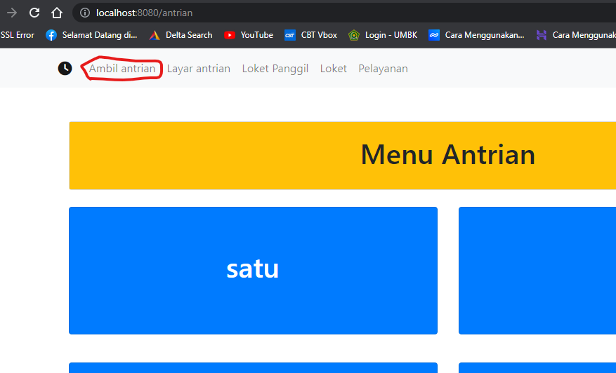

# UAS_Pemrograman

# NAMA  : Ibnu Fajar
# NIM   : 312010420
# KELAS : TI. 20 A1

# PERAKTIKUM UAS PEMROGRAMAN WEB 

**LANGKAH PERTAMA** 
kali ini kita bikin sebuah website sederhana dengan tema antrian, Kita instal terlebih dahulu CodeIgniter untuk kerangka PHP agar bisa membangun situs websitenya, seperti gambar berikut; 
 
lalu kita buka XAMPP kita nyalahkan Apache dan MySQL, seperti gambar berikut; 
 

**LANGKAH KEDUA** 
Kita membikin database di"PHPMyadmin" seperti gambar berikut; 
 
lalu kita buka berkas *"Ci4"* di Visual Studio Code dan kita coding didalamnya atau bikin kerangka sebuah website tersebut, dan Export Database *SQLnya* keberkas Ci4 seperti gambar berikut; 
 
 

**LANGKAH KETIGA** 
ketika kerangka website telah jadi diberkas Ci4 yang telah kita buat di Visual Studio Code, lalu kita buka *"shell"* dan kita ketik perintah sebagai berikut; 
 
ketika perintah berasil, setelah itu kalian salin *URLnya* dibagian teks berwarna hijau lalu buka browser dan tempel URL yang telah disalin seperti gambar berikut: 
 

**LANGKAH TERAKHIR** 
Alhamdulillah sudah jadi, tinggal kita cek-cek menu-menu Websitenya 
Jadi ini bagian *"Menu Antrian"* 
 
Ini bagian *"Layanan Antrian"* 
 
Ini bagian *"Loket Panggil"* 
 
Ini bagian *"Loket Pelayanan"* 
 

